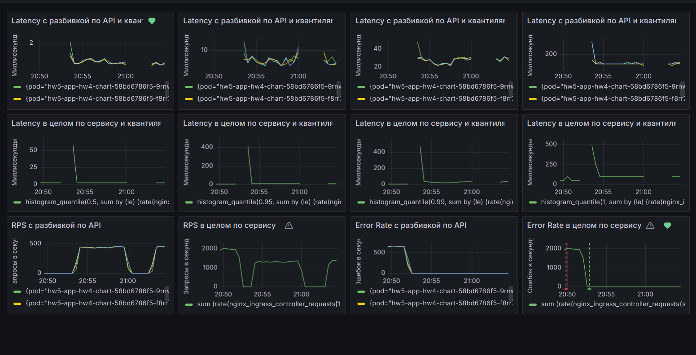
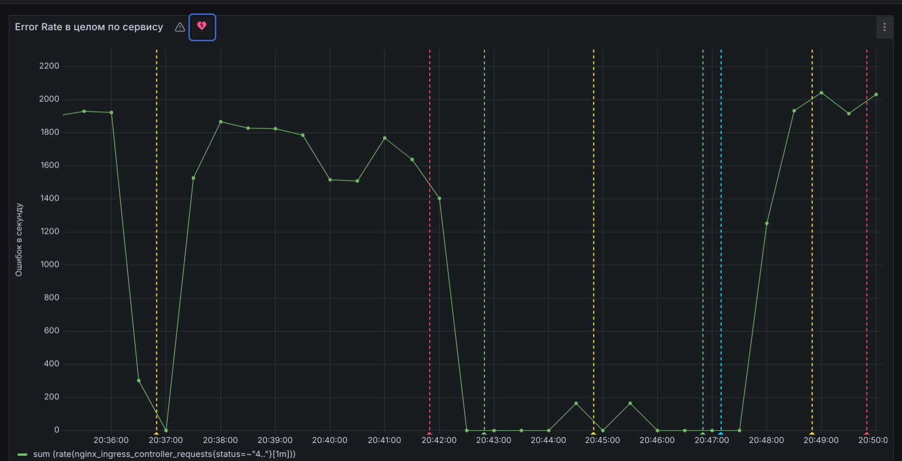
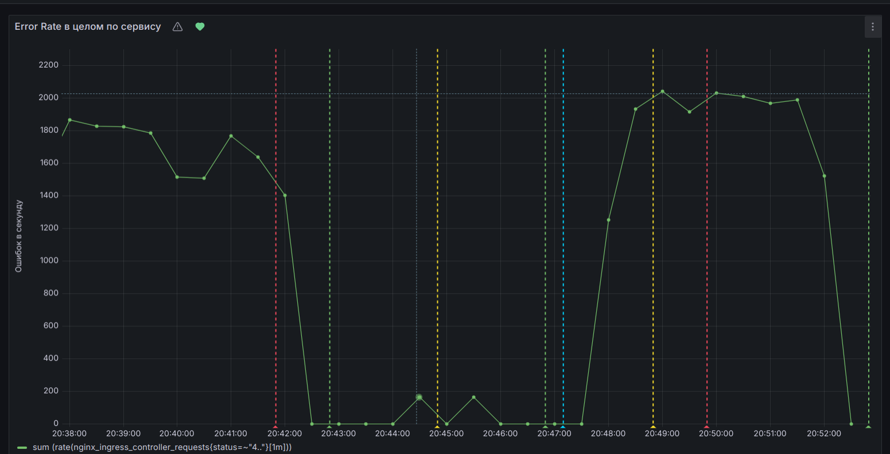

# HW5 - Prometheus + Grafana

## Установка
1. Eсли нужен чистый миникуб
```console
minikube delete - если нужен чистый миникуб
```
2. Запускаем миникуб
```console
minikube start
```
3. Создаем namespace
```console
kubectl create namespace hw5
```
4. Добавляем реплозитории
```console
helm repo add prometheus-community https://prometheus-community.github.io/helm-charts 
helm repo add ingress-nginx https://kubernetes.github.io/ingress-nginx
helm repo update
```
5. Устанавливаем prometheus+grafana
```console
helm install stack prometheus-community/kube-prometheus-stack -f ./k8s/prometheus.yaml -n hw5
```
6. Устанавливаем ingress nginx + параметры чтобы отдавал метрики в prometheus
```console
helm install nginx ingress-nginx/ingress-nginx -f ./k8s/nginx-ingress.yaml -n hw5
```
7. Прибиваем ingressclasses, без этого у меня не получалось
```console
kubectl delete ingressclasses --all
```
8. Смотрим поды, должидаемся пока все подниматся
```console
kubectl get all -n hw5
```
9. В отдельной консоли пробрасываем доступ к prometheus
```console
kubectl port-forward service/prometheus-operated  9090 -n hw5
```
10. В отдельной консоли пробрасываем доступ к grafana
```console
kubectl port-forward service/stack-grafana  9000:80 -n hw5
```
11. В отдельных консолях запускаем нагрузку 
```console
ab -n 500000 -c 5 http://arch.homework/api/v1/user/1
ab -n 500000 -c 5 http://arch.homework/api/v1/user/2
ab -n 500000 -c 5 http://arch.homework/get404
```

## Удаление
```console
helm uninstall hw5-app -n hw5
```

## Настройка grafana
1. Креды от grafana
admin / prom-operator
2. Json для импорта дашборда
[grafana.json](grafana.json)
3. Скрин дашборда при нагрузке

4. Мониторинг ошибок и алерты настроены на ошибки 4xx, т.к. их проще воспроизвести
5. Скрины алертов



## Тесты
```console
newman run https://api.postman.com/collections/7102499-0408f18d-64b1-46f2-9a32-7b4c4b3c99a1?access_key=PMAT-01HV232QPCA4H74F5X9RZYVFPN
```

### Полезные ресты
1. Получить юзера
```console
curl http://localhost:8081/api/v1/user/1 -I
```

2. Создать юзера
```console
curl --location --request POST 'http://localhost:8081/api/v1/user' \
--header 'Content-Type: application/json' \
--data-raw '{"firstName": "Pedro", "lastName": "Gonzales"}'
```

3. Апдейтить юзера
```console
curl --location --request PUT 'http://localhost:8081/api/v1/user/1' \
--header 'Content-Type: application/json' \
--data-raw '{"id": 1, "firstName": "Ivan", "lastName": "Pupkin"}'
```

4. Удалить юзера
```console
curl --location --request DELETE 'http://localhost:8081/api/v1/user/1'
```


## Информация для меня

### Полезные команды
1. Пробосить порт для тестов - открыть в отдельном окне
```console
kubectl port-forward -n hw4 service/hw4-app-postgresql  5439:5432
```
2. Подключиться к базе
```console
psql --host 127.0.0.1 -U postgres -d postgres -p 5439
```
3. Установка постгреса
```console
helm install pg-minikube --set auth.postgresPassword=pas bitnami/postgresql -n hw4
```
4. Посмотреть объекты
```console
kubectl get all -n hw4
```
5. Алиас для kubectl
```console
alias kubectl='minikube kubectl -- 
```
6. Залить образ в dockerhub
```console
docker login -u sden81
docker build -t hw4-app:v1.1 .
docker image ls
docker tag hw4-app:v1.1 sden81/otus-ms-arch-2023-12-hw4-img:v1.1
docker push sden81/otus-ms-arch-2023-12-hw4-img:v1.1
```
7. Консоль пода
```console
kubectl exec -it -n hw4 hw4-app-hw4-chart -- sh
```
8. Лог пода
```console
kubectl logs -n hw4 hw4-app-hw4-chart
```

### Полезные ссылки
1. https://www.bezkoder.com/spring-boot-r2dbc-postgresql/
2. https://blog.tericcabrel.com/push-docker-image-docker-hub/
3. https://github.com/schetinnikov-otus/arch-labs/tree/master/nginx-forward-auth


## Тут всякое, может потом пригодиться

kubectl create namespace hw5
helm install stack prometheus-community/kube-prometheus-stack -f ./k8s/prometheus.yaml -n hw5
helm install nginx ingress-nginx/ingress-nginx -f ./k8s/nginx-ingress.yaml -n hw5
kubectl delete ingressclasses --all
helm upgrade --install hw5-app -n hw5 ./hw4-chart
kubectl get all -n hw5
kubectl port-forward service/prometheus-operated  9090 -n hw5
kubectl port-forward service/stack-grafana  9000:80 -n hw5
admin / prom-operator


ab -n 500000 -c 5 http://arch.homework/api/v1/user/1
ab -n 500000 -c 5 http://arch.homework/get404

histogram_quantile(0.5, sum by(le,pod, uri) (rate(http_server_requests_seconds_bucket{uri="/api/v1/user/{id}"}[1m])))
histogram_quantile(0.95, sum by(le,pod, uri) (rate(http_server_requests_seconds_bucket{uri="/api/v1/user/{id}"}[1m])))

sum by (pod, uri) (rate(http_server_requests_seconds_count{uri="/api/v1/user/{id}"}[1m])) 
sum (http_server_requests_seconds_count{status=~"4.."}) by (pod)


histogram_quantile(0.5, sum by(le,pod, uri) (rate(http_server_requests_seconds_bucket{uri="/api/v1/user/{id}"}[1m]))) * 1000
histogram_quantile(0.95, sum by(le,pod, uri) (rate(http_server_requests_seconds_bucket{uri="/api/v1/user/{id}"}[1m]))) * 1000
histogram_quantile(0.99, sum by(le,pod, uri) (rate(http_server_requests_seconds_bucket{uri="/api/v1/user/{id}"}[1m]))) * 1000
histogram_quantile(1, sum by(le,pod, uri) (rate(http_server_requests_seconds_bucket{uri="/api/v1/user/{id}"}[1m]))) * 1000
sum by (pod, uri) (rate(http_server_requests_seconds_count{uri="/api/v1/user/{id}"}[1m]))
sum by (pod, uri)(http_server_requests_seconds_count{status=~"4.."})


histogram_quantile(0.5, sum by (le) (rate(nginx_ingress_controller_request_duration_seconds_bucket[1m]))) * 1000
histogram_quantile(0.95, sum by (le) (rate(nginx_ingress_controller_request_duration_seconds_bucket[1m]))) * 1000
histogram_quantile(0.99, sum by (le) (rate(nginx_ingress_controller_request_duration_seconds_bucket[1m]))) * 1000
histogram_quantile(1, sum by (le) (rate(nginx_ingress_controller_request_duration_seconds_bucket[1m]))) * 1000

histogram_quantile(0.5, sum by (le,pod, uri) (rate(nginx_ingress_controller_request_duration_seconds_bucket{status=~"2.*"}[1m]))) * 1000
histogram_quantile(0.95, sum by (le,pod, uri) (rate(nginx_ingress_controller_request_duration_seconds_bucket{status=~"2.*"}[1m]))) * 1000
histogram_quantile(0.99, sum by (le,pod, uri) (rate(nginx_ingress_controller_request_duration_seconds_bucket{status=~"2.*"}[1m]))) * 1000
histogram_quantile(1, sum by (le,pod, uri) (rate(nginx_ingress_controller_request_duration_seconds_bucket{status=~"2.*"}[1m]))) * 1000
sum (rate(nginx_ingress_controller_requests{status=~"2.*"}[1m]))
sum by (pod, uri)(nginx_ingress_controller_requests{status=~"4.."})

RPC
sum (rate(nginx_ingress_controller_requests{status=~\"2.*\"}[1m]))


sum by (pod, uri) (rate(http_server_requests_seconds_count{status="200"}[1m]))
sum (rate(nginx_ingress_controller_requests{status=~\"2.*\"}[1m]))

histogram_quantile(1, sum by (le) (rate(nginx_ingress_controller_request_duration_seconds_bucket{status=~\"2.*\"}[1m]))) * 1000
sum by (status) (increase(nginx_ingress_controller_request_duration_seconds_count{status=~\"5.+\"}[1m]))
