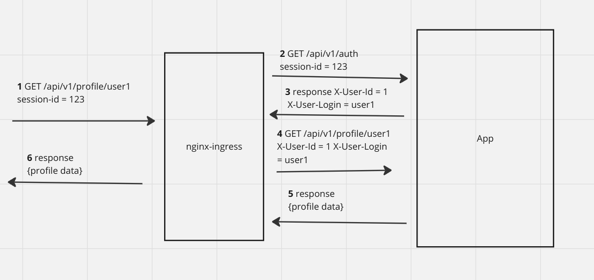

# HW6- API Gateway

## Описание архитектурного решения
Auth-service и App-service реализованы в рамках одного приложения и развернуты в одном поде. Входящий трафик обрабатывается двумя ingress контроллерами.

hw6-ingress-auth обрабатывает:
* POST /api/v1/registration - регистрация пользователя
* POST /api/v1/login - аутефикация, по правильному логину и паролю ставиться кука session-id 
* GET /api/v1/logout - выход
* GET /api/v1/auth - по нему ingress перенаправляет любой запрос, где исходя из правильного session-id выставляются заголовки X-User-Id,X-User-Login

hw6-ingress-app обрабатывает(если есть заглловки X-User-Id,X-User-Login):
* GET /api/v1/profile/{login} - получить профиль
* PUT /api/v1/profile/{login} - редактировать профиль



## Установка
```console
minikube delete - если нужен чистый миникуб
```
```console
minikube start
```
```console
minikube addons enable ingress
```
```console
kubectl create namespace hw6
```
```console
helm upgrade --install hw6-app -n hw6 ./hw6-chart
```
```console
kubectl get all -n hw6
```

## Удаление
```console
helm uninstall hw6-app -n hw6
```

## Тесты
```console
newman run "Otus Arch HW6.postman_collection.json"
или
newman run https://api.postman.com/collections/7102499-370cdab6-eaac-49f6-b40e-1e0641fef6ed?access_key=PMAT-01HXA66CR496R0RCW8GHJ7JEED
```


## Информация для меня

### Полезные команды
1. Пробосить порт для тестов - открыть в отдельном окне
```console
kubectl port-forward -n hw6 service/hw6-app-postgresql  5439:5432
```
2. Подключиться к базе
```console
psql --host 127.0.0.1 -U postgres -d postgres -p 5439
```
3. Установка постгреса
```console
helm install pg-minikube --set auth.postgresPassword=pas bitnami/postgresql -n hw6
```
4. Посмотреть объекты
```console
kubectl get all -n hw6
```
5. Алиас для kubectl
```console
alias kubectl='minikube kubectl -- 
```
6. Залить образ в dockerhub
```console
docker login -u sden81
docker build -t hw6-app:v1.1 .
docker image ls
docker tag hw6-app:v1.1 sden81/otus-ms-arch-2023-12-hw6-img:v1.1
docker push sden81/otus-ms-arch-2023-12-hw6-img:v1.1
```
7. Консоль пода
```console
kubectl exec -it -n hw6 hw4-app-hw6-chart -- sh
```
8. Лог пода
```console
kubectl logs -n hw6 hw6-app-hw6-chart
```

### Полезные ссылки
1. https://www.bezkoder.com/spring-boot-r2dbc-postgresql/
2. https://blog.tericcabrel.com/push-docker-image-docker-hub/
3. https://github.com/schetinnikov-otus/arch-labs/tree/master/nginx-forward-auth

